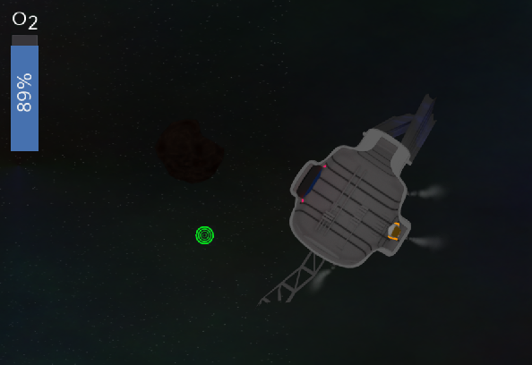
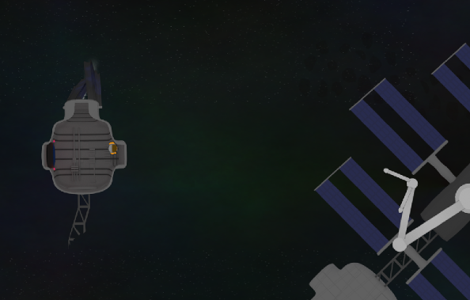

# Destructive Controls

*Destructive Controls* is a game developed at the second [Hasi](https://hasi.it) game
jam with the [Godot game engine](https://godotengine.org/) (Version 2.2). The game is
inspired by the game jam's theme:
> Du hast keine Chance; nutze sie!

Or in english "You have no chance; use it!"

In the game a part of your space station with yourself inside it breaks off
during an asteroid shower. And your last chance to get back to the rest of
the station is to push the capsule forward by releasing air.

## Screenshots

## How to play
Drill or Patch holes into your capsule to return to what is left of your
space station.

**Move**: WASD / ARROW KEYS  
**Drill Hole**: SPACE / ENTER  
**Patch Hole**: F / NUMPAD 0  

## Authors
- Hannes [GitHub](https://gitHub.com/derhannesb)
- Moritz [GitHub](https://gitHub.com/MoritzKn) [Twitter](https://twitter.com/Kredo374)

## License
[CC BY-SA 2.0](https://creativecommons.org/licenses/by-sa/2.0/)
